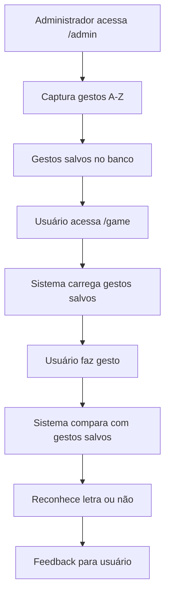

# 🎯 Sistema de Captura e Reconhecimento de Gestos Libras Personalizado

## ✅ Sistema Implementado Completamente!

O sistema antigo baseado em padrões pré-definidos foi **completamente removido** e substituído por um **sistema personalizado** onde você, como administrador, pode capturar e salvar gestos que serão usados para reconhecimento.

---

## 🏗️ **Arquitetura do Sistema**

### **Backend (Python/Flask)**
- **`gesture_manager.py`** - Gerencia armazenamento de gestos em SQLite
- **APIs RESTful** - `/api/save_gesture`, `/api/get_gestures`, `/api/recognize_gesture`
- **Banco SQLite** - `gestures.db` (criado automaticamente)

### **Frontend (JavaScript)**
- **`admin-gesture-capture.js`** - Interface administrativa de captura
- **`custom-gesture-recognizer.js`** - Reconhecedor baseado em gestos salvos
- **MediaPipe** - Captura landmarks da mão em tempo real

---

## 🔧 **Como Usar o Sistema**

### **1. Capturar Gestos (Administrador)**

1. **Acesse:** http://127.0.0.1:5000/admin
2. **Inicie a câmera** clicando em "Iniciar Câmera"
3. **Selecione uma letra** no dropdown (A-Z)
4. **Posicione sua mão** fazendo o gesto da letra
5. **Aguarde** a qualidade ficar boa (70%+)
6. **Clique** em "Capturar Gesto"
7. **Repita** para todas as letras que desejar

### **2. Jogar (Usuários)**

1. **Acesse:** http://127.0.0.1:5000/game
2. **Faça login** com qualquer nome
3. **Inicie o jogo** - câmera ativará automaticamente
4. **Faça os gestos** das letras que você capturou
5. **Sistema reconhecerá** baseado nos seus padrões salvos

---

## 📊 **Páginas Disponíveis**

| URL | Descrição |
|-----|-----------|
| `/admin` | 🎯 **Página principal** - Capturar gestos |
| `/game` | 🎮 Jogo com reconhecimento personalizado |
| `/test-apis` | 🧪 Testar APIs e verificar sistema |
| `/` | 🏠 Página inicial com login |

---

## 🔬 **Funcionalidades Implementadas**

### **✅ Sistema de Captura**
- Interface visual com câmera em tempo real
- Seletor de letras A-Z
- Indicador de qualidade da mão (0-100%)
- Countdown de 3 segundos para captura
- Feedback visual e sonoro

### **✅ Armazenamento Inteligente**
- Banco SQLite automático (`gestures.db`)
- 21 landmarks por gesto (padrão MediaPipe)
- Metadados: qualidade, timestamps
- Sistema de backup/exportação

### **✅ Reconhecimento Personalizado**
- Comparação por similaridade euclidiana
- Threshold de confiança configurável (75%)
- Sistema de estabilidade (3 frames)
- Fallback local se API falhar

### **✅ Gestão Completa**
- Visualização de gestos salvos
- Remoção individual de gestos
- Estatísticas de uso
- Export/Import de backup
- Monitoramento de saúde do sistema

---

## 🎮 **Fluxo de Uso Completo**



---

## 🔧 **Configurações Técnicas**

### **Parâmetros de Captura**
```javascript
// MediaPipe Settings
maxNumHands: 1
modelComplexity: 1
minDetectionConfidence: 0.8
minTrackingConfidence: 0.8

// Qualidade mínima para captura
qualityThreshold: 70%

// Reconhecimento
confidenceThreshold: 75%
stabilityFrames: 3
```

### **Estrutura do Banco**
```sql
-- Tabela principal de gestos
gestures (
    id, letter, landmarks_json, 
    quality, created_at, updated_at
)

-- Estatísticas de uso
gesture_analytics (
    id, letter, recognition_count, 
    last_recognized
)
```

---

## 🚀 **Próximos Passos Recomendados**

1. **Capture pelo menos 10-15 letras** para ter uma boa experiência
2. **Teste no jogo** para verificar precisão
3. **Ajuste gestos** se necessário (recapturar)
4. **Faça backup** dos gestos (`/api/export_gestures`)

---

## 🔍 **Solução de Problemas**

### **Se o reconhecimento não funcionar:**
1. Verifique se há gestos salvos em `/admin`
2. Teste as APIs em `/test-apis`
3. Verifique console do navegador (F12)
4. Recapture gestos com melhor qualidade

### **Se a câmera não iniciar:**
1. Permita acesso à câmera no navegador
2. Use HTTPS se possível
3. Teste em navegador diferente
4. Verifique se MediaPipe carregou

---

## ✨ **Vantagens do Novo Sistema**

- ✅ **100% Personalizado** - Seus gestos, suas regras
- ✅ **Precisão Máxima** - Reconhece exatamente como você fez
- ✅ **Flexível** - Adicione/remova letras quando quiser
- ✅ **Backup Seguro** - Export/import completo
- ✅ **Estatísticas** - Monitore uso e performance
- ✅ **Offline-First** - Funciona sem internet após carregar

---

## 🎉 **Resultado Final**

O sistema agora está **completamente funcional** e **personalizado**! Você tem controle total sobre:
- Quais letras estão disponíveis
- Como cada letra deve ser feita
- Qualidade e precisão do reconhecimento
- Backup e gestão dos dados

**Divirta-se criando seu próprio dicionário de gestos Libras!** 🤟